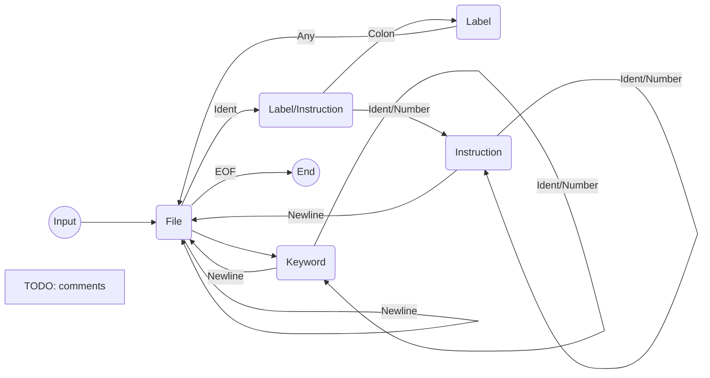

# DFA for the parser

```mermaid
graph LR
    input((Input))-->file(File)
    file -- Ident --> label_or_instr(Label/Instruction)

    label_or_instr -- Colon --> label(Label)
    label-- Any --> file

    label_or_instr -- Ident/Number --> instruction(Instruction)
    instruction -- Ident/Number --> instruction
    instruction -- Newline --> file

    file --> kword(Keyword)
	kword -- Ident/Number --> kword
	kword -- Newline --> file

	file -- Newline --> file

	file -- EOF --> stop((End))

    todo[TODO: comments]
```
